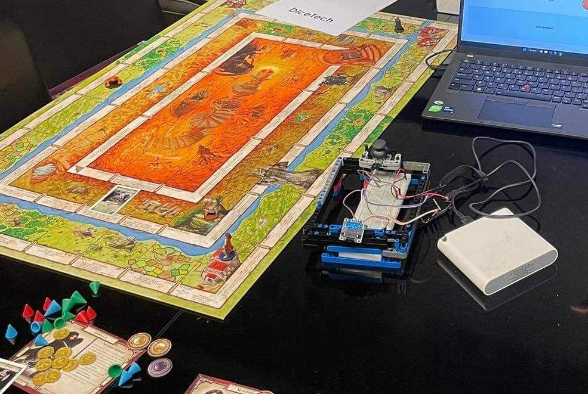
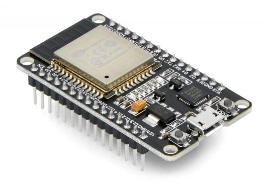

# BoardgameAssistant
## Embeded assistant for remembering stats
The concept of this college group project was to eliminate the risk of losing small board game pieces by integrating an embedded program. This program provides a real-time PC display, making it easier to manage and remember game elements during tournaments or party games.  

## Technologies
The hardware component of the application is developed in MicroPython, while the PC display interface is implemented in Python. We used an ESP32 chip, which includes built-in WiFi, to facilitate real-time communication with the display PC.  

